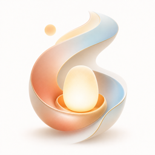
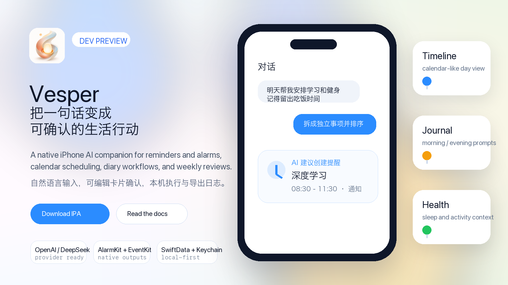

<p align="center">
  
</p>

<h1 align="center">Vesper</h1>

<p align="center">
  <strong>Natural language in. Editable life actions out.</strong><br>
  <sub>原生 iPhone 私人助理：把一句话变成可确认、可编辑、可执行的提醒、闹钟、日历和日记。</sub>
</p>

<p align="center">
  <a href="LICENSE"></a>
  
  
  
  <a href="https://github.com/jsyzlbw/vesper/stargazers"></a>
</p>

<p align="center">
  <a href="#-简体中文">简体中文</a>
  ·
  <a href="#-english">English</a>
  ·
  <a href="https://github.com/jsyzlbw/vesper/releases/latest">Download IPA</a>
  ·
  <a href="docs/vesper-user-guide-zh-Hans.md">User Guide</a>
</p>

<p align="center">
  
</p>

## 简体中文

Vesper 是一个原生 iPhone AI companion。你不用学习命令，也不用手工配置复杂自动化；只要像聊天一样说出意图，Vesper 会把它变成清晰的、可编辑的、需要你确认后才执行的行动卡片。

> 例如：`明天 8:30 学深度学习，下午健身，记得留出吃饭时间。`

Vesper 会把“完整计划”拆成多个独立事项，按时间排序，并在你确认后写入通知、真闹钟、日历或日记。AI 负责理解和提案，用户保留最终确认权，App 负责可靠执行。

### 30 秒看懂

| 你说 | Vesper 做 |
| --- | --- |
| “15 分钟后提醒我去吃饭” | 生成可编辑提醒卡片，确认后发系统通知 |
| “明天早上 7 点设闹钟” | iOS 26+ 使用 AlarmKit 创建真闹钟 |
| “帮我明天安排学习和健身，记得吃饭” | 拆成多个事项，按时间排序，保留三餐/休息 |
| “把今天整理成日记” | 保存本机日记，可在时间线按日期查看 |
| “每周日晚上总结一下这一周” | 生成周记，结合日历、运动、睡眠给建议 |

### 为什么值得 Star

| 能力 | 价值 |
| --- | --- |
| 对话式计划 | 不需要学习命令；自然语言就是入口 |
| 可编辑确认卡片 | AI 不直接乱执行；每一步都可检查、可修改 |
| 原生系统能力 | 通知、日历、HealthKit、AlarmKit 都走 iOS 原生能力 |
| 本地优先 | API Key 在 Keychain，数据在本机 SwiftData |
| 多 Provider | OpenAI、Anthropic、Gemini、DeepSeek、硅基流动、Custom |
| Debug 友好 | 可导出用户消息、AI 回复、工具调用和本地记录 |

### 安装预览版

最新开发版 IPA 在 [GitHub Releases](https://github.com/jsyzlbw/vesper/releases/latest)。

当前 IPA 是开发签名版本，可以用爱思助手 / 3uTools 安装，但目标 iPhone 必须包含在对应 provisioning profile 中。

### 本地构建

```bash
git clone https://github.com/jsyzlbw/vesper.git
cd vesper
swift test --package-path DiaryCompanionCore
xcodebuild -project DiaryCompanion.xcodeproj \
  -scheme DiaryCompanion \
  -destination 'platform=iOS Simulator,name=iPhone 17 Pro' \
  build
```

### 当前状态

Vesper 仍是 development preview。当前重点是把自然语言解析、日历式时间线、TestFlight 内测和真机体验继续打磨到可以稳定给同学测试。

## English

Vesper is a native iPhone AI companion. You describe intent in natural language; Vesper turns it into explicit, editable, confirmable action cards.

> Example: `Plan tomorrow: deep learning at 8:30, gym in the afternoon, and keep meals open.`

Vesper splits full-day plans into separate time-sorted items, then creates notifications, real alarms, calendar events, or diary entries only after user confirmation.

### What It Does

| Input | Output |
| --- | --- |
| “Remind me to eat in 15 minutes” | Editable reminder card, then a system notification |
| “Set an alarm for 7 AM tomorrow” | Real AlarmKit alarm on iOS 26+ |
| “Plan study and gym tomorrow, keep meals open” | Separate time-sorted items with meal/rest buffers |
| “Turn today into a diary entry” | Local diary entry visible on the timeline |
| “Review my week every Sunday night” | Weekly review with calendar, activity, and sleep context |

### Highlights

| Area | Detail |
| --- | --- |
| Conversational workflow | Natural language is the primary interface |
| Human confirmation | AI proposes; the user edits and confirms |
| Native iOS outputs | Notifications, Calendar, HealthKit, and AlarmKit |
| Local-first storage | Keychain for API keys, SwiftData for records |
| Provider flexibility | OpenAI, Anthropic, Gemini, DeepSeek, SiliconFlow, Custom |
| Debuggability | Export conversations, AI replies, tool calls, and local state |

### Install

Download the latest development IPA from [GitHub Releases](https://github.com/jsyzlbw/vesper/releases/latest). The current build is development-signed, so the target iPhone must be included in the provisioning profile.

### Build

```bash
git clone https://github.com/jsyzlbw/vesper.git
cd vesper
swift test --package-path DiaryCompanionCore
xcodebuild -project DiaryCompanion.xcodeproj \
  -scheme DiaryCompanion \
  -destination 'platform=iOS Simulator,name=iPhone 17 Pro' \
  build
```

## Project Signal

| Signal | Badge |
| --- | --- |
| Stars |  |
| Forks |  |
| Latest release |  |
| Open issues |  |

<details>
<summary>Star history</summary>

<a href="https://star-history.com/#jsyzlbw/vesper&Date">
  <picture>
    <source media="(prefers-color-scheme: dark)" srcset="https://api.star-history.com/svg?repos=jsyzlbw/vesper&type=Date&theme=dark">
    
  </picture>
</a>

</details>

## License

MIT. See [LICENSE](LICENSE).
