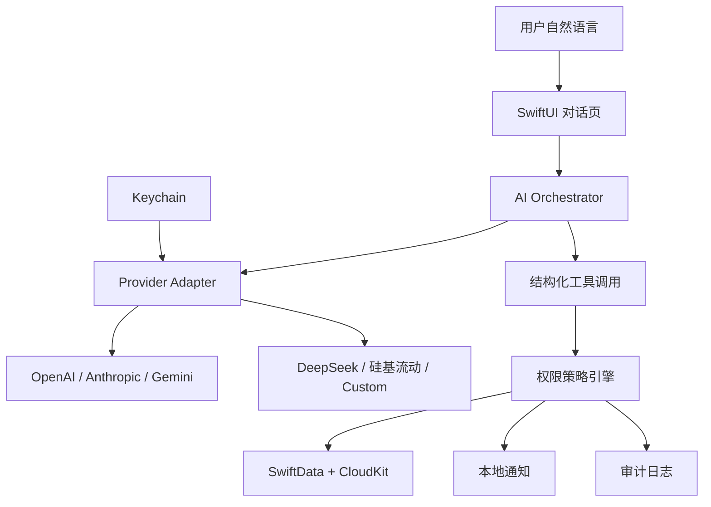
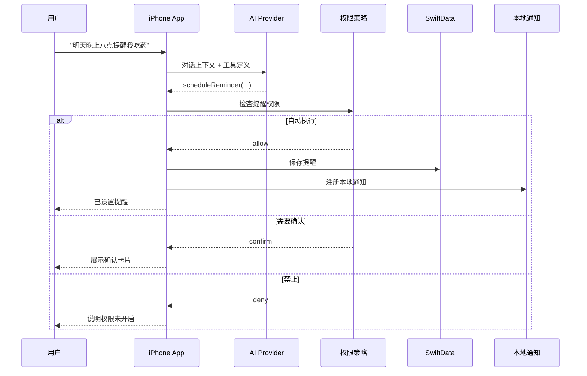

# iOS Diary Companion 设计

日期: 2026-05-31
状态: 设计已批准，等待实施计划

## 1. 概述

将旧的聊天机器人、cc-connect、Claude Code 和 Mac 脚本个人日记原型，迁移为一个 mobile-first 的原生 iPhone App。

App 独立运行，不依赖常驻 Mac 服务。用户主要通过自然语言与 AI 对话，由 AI 调用结构化工具完成日记、任务、提醒、饮食、体重、用药和每日总结等操作。

Codex 负责项目开发、测试和维护，不作为 App 运行时。旧聊天机器人入口已归档，不再作为运行路径维护。

## 2. 产品目标

### 2.1 首版目标

- 支持用户使用自然语言与 AI 对话。
- 由 AI 调用本地工具记录和修改个人数据。
- 支持日记、任务、提醒、饮食、体重、用药和每日总结。
- 使用 SwiftData 保存本地数据，并通过用户私有 CloudKit 容器同步。
- 使用 iOS 本地通知主动提醒用户。
- 支持多个 AI Provider，用户自行配置 API Key。
- 根据用户设置决定 AI 工具调用自动执行、确认后执行或禁止执行。
- 保存工具执行审计记录，便于追溯 AI 行为。

### 2.2 长期目标

- 先通过 Xcode 安装到开发者自己的 iPhone。
- 稳定后通过 TestFlight 提供给同学试用。
- 完善隐私、权限、可靠性和产品体验后，再考虑发布到 App Store。

### 2.3 首版不做

- HealthKit 自动读取和健康周报。
- Apple Calendar 双向同步和 AI 自动排程。
- 通用 OAuth 登录。
- 自建后端。
- 远程推送通知。
- 多人共享空间。
- App Store 订阅和计费。
- 复杂仪表盘和表单驱动录入。

## 3. 架构



### 3.1 运行边界

- App 在 iPhone 上独立运行。
- 普通数据写入优先落到本地 SwiftData，离线时仍可使用。
- SwiftData 通过用户私有 CloudKit 容器同步数据。
- Provider API Key 仅保存到 Keychain，不写入 SwiftData、CloudKit 或日志。
- AI 请求仅发送完成当前任务所需的最小上下文，不默认上传全部历史记录。
- 主动提醒由本地通知实现，不要求 App 常驻后台，也不依赖 Mac 在线。

### 3.2 工程分层

```text
DiaryCompanion/
├── App/                 # 启动、依赖注入、路由
├── Features/
│   ├── Chat/
│   ├── Timeline/
│   ├── Settings/
│   └── AuditLog/
├── Domain/
│   ├── Models/
│   ├── Tools/
│   └── Permissions/
├── Data/
│   ├── Persistence/     # SwiftData + CloudKit
│   ├── Keychain/
│   └── Notifications/
├── AI/
│   ├── Orchestrator/
│   ├── OpenAI/
│   ├── Anthropic/
│   ├── Gemini/
│   └── OpenAICompatible/
└── Tests/
```

Provider 适配器只负责请求构造、流式响应处理和工具调用格式转换。工具执行、权限判断和数据写入由本地模块负责。切换 Provider 或模型不应改变本地业务行为。

## 4. AI Provider

### 4.1 首版支持

| Provider | 接入方式 |
|----------|----------|
| OpenAI | 独立适配器 |
| Anthropic | 独立适配器 |
| Gemini | 独立适配器 |
| DeepSeek | OpenAI-compatible 适配器预设 |
| 硅基流动 | OpenAI-compatible 适配器预设 |
| Custom | OpenAI-compatible 适配器，自定义名称、Base URL、API Key 和模型名 |

### 4.2 BYOK

- 首版采用 Bring Your Own Key。
- API Key 存入 iOS Keychain。
- Provider 设置记录名称、协议类型、Base URL、模型名和启用状态。
- Provider 设置可以同步，但 API Key 不同步。
- 未配置 API Key 时，阻止发送请求并引导用户前往设置页。

### 4.3 OAuth 边界

首版不实现 OAuth。后续仅对官方明确支持移动端 OAuth 的平台单独接入。不得假设所有 AI 平台都可以共用 OAuth 流程，也不得在 App 内嵌不受支持的登录方案。

## 5. 数据模型

| 模型 | 主要字段 | 用途 |
|------|----------|------|
| `Conversation` | 标题、创建时间、最近消息时间 | 对话上下文 |
| `Message` | 角色、正文、时间、工具调用摘要、状态 | 用户和 AI 消息 |
| `DiaryEntry` | 日期、正文、标签、来源消息 ID | 日记记录 |
| `TaskItem` | 标题、备注、截止时间、完成状态、来源消息 ID | 待办任务 |
| `Reminder` | 关联任务、触发时间、重复规则、通知状态 | 本地提醒 |
| `WeightRecord` | 日期、体重 | 体重记录 |
| `MealRecord` | 餐次、时间、描述、AI 建议 | 饮食记录 |
| `MedicationRecord` | 药品、时间、状态、备注 | 用药记录 |
| `DailySummary` | 日期、AI 总结、生成时间 | 每日总结 |
| `ToolAuditLog` | 工具名、参数摘要、权限决策、执行结果、时间 | AI 行为审计 |
| `ProviderProfile` | 名称、协议类型、Base URL、模型名、启用状态 | AI Provider 配置 |

### 5.1 CloudKit 规则

- 使用用户私有 CloudKit 容器。
- 业务数据由 SwiftData 本地保存后同步。
- API Key 不进入 CloudKit。
- 审计日志不记录原始 API Key、Authorization header 或完整敏感请求。
- 同步失败时保留本地数据，并在设置页展示同步状态。

## 6. AI 工具与权限

### 6.1 首版工具

| 工具 | 行为 |
|------|------|
| `createDiaryEntry` | 新增日记 |
| `updateDiaryEntry` | 更新已有日记 |
| `recordWeight` | 记录体重 |
| `recordMeal` | 记录饮食 |
| `updateMedication` | 记录或更新用药状态 |
| `createTask` | 新增任务 |
| `completeTask` | 完成任务 |
| `scheduleReminder` | 创建本地提醒 |
| `generateDailySummary` | 生成并保存每日总结 |

### 6.2 权限策略

每个能力域由用户设置执行策略：

- `自动执行`
- `执行前确认`
- `禁止`

能力域包括：

- 日记
- 任务
- 提醒
- 体重
- 饮食
- 用药
- AI 总结

删除、批量修改和清空数据属于高风险操作。即使对应能力域允许自动执行，也必须单独经过高风险策略检查。首版默认要求执行前确认。

### 6.3 工具执行流程



每次工具调用均写入 `ToolAuditLog`。日志需要记录权限决策、执行结果和可安全展示的参数摘要。

## 7. 页面结构

### 7.1 Chat

- 默认首页。
- 支持自然语言输入和流式 AI 回复。
- 展示工具执行结果。
- 对需要确认的操作展示确认卡片。
- 点击通知后打开对应对话上下文。

### 7.2 Timeline

- 按日期浏览日记、任务、饮食、体重、用药和总结。
- 用于检查 AI 是否正确记录数据。
- 首版以浏览和轻量纠错为主，不设计复杂仪表盘。

### 7.3 Settings

- 配置 AI Provider、模型、Base URL 和 API Key。
- 配置每个能力域的工具权限。
- 配置本地通知。
- 查看 CloudKit 同步状态。

### 7.4 Audit Log

- 查看 AI 调用过的工具。
- 查看权限决策和执行结果。
- 用于定位误操作和调试 Provider 行为。

## 8. 主动提醒

- 使用 `UserNotifications` 注册本地通知。
- 支持早间提醒、晚间总结提醒和任务提醒。
- 通知内容由本地保存的数据和模板生成。
- 用户点击通知后进入对应聊天上下文。
- 用户拒绝通知权限时，提醒仍保存，但 App 必须明确提示系统通知不会送达。
- 首版不依赖远程推送或后台常驻进程。

## 9. 错误处理

| 场景 | 处理方式 |
|------|----------|
| Provider 请求失败 | 保留用户消息，支持重试或切换 Provider |
| Provider 返回未知工具 | 拒绝执行，记录审计日志 |
| 工具参数不完整 | 不执行，要求 AI 继续追问 |
| 权限策略要求确认 | 展示确认卡片，用户确认后执行 |
| 权限策略禁止执行 | 拒绝调用，并说明需要修改设置 |
| CloudKit 暂时不可用 | 本地继续写入，稍后同步 |
| 本地通知权限未开启 | 保存提醒，并提示通知不会送达 |
| Keychain 中缺少 API Key | 阻止请求，引导到 Provider 设置 |

## 10. 测试策略

### 10.1 自动测试

- 单元测试：Provider 请求构造、流式响应解析、工具调用解析。
- 单元测试：权限策略，包括自动执行、确认、禁止和高风险覆盖。
- 单元测试：数据写入、查询和离线状态。
- 单元测试：本地通知注册参数。
- UI 测试：聊天、设置、确认弹窗、Timeline、审计日志和通知跳转。
- 使用 iPhone 模拟器自动构建、安装、启动和执行 UI 回归。

### 10.2 真机测试

以下行为必须补充真机验证：

- 用户私有 CloudKit 容器同步。
- Keychain 生命周期和重装行为。
- 本地通知授权。
- 本地通知实际到达和跳转。
- App 在离线后恢复联网时的数据同步。

### 10.3 本机测试环境

- Xcode: `26.5`
- iOS Simulator Runtime: `26.5`
- 默认模拟器: `iPhone 17 Pro`

## 11. 分阶段交付

### 阶段 1：工程基础

- 创建 SwiftUI 工程。
- 配置 SwiftData、CloudKit capability 和本地数据模型。
- 实现 Keychain 存储。
- 实现基础导航。

### 阶段 2：Provider

- 实现 OpenAI、Anthropic 和 Gemini 独立适配器。
- 实现 OpenAI-compatible 适配器。
- 添加 DeepSeek、硅基流动和 Custom 预设。
- 添加 Provider 设置页。

### 阶段 3：聊天与工具

- 实现聊天页和流式响应。
- 实现工具协议。
- 实现权限策略和确认卡片。
- 实现审计日志。

### 阶段 4：业务闭环

- 实现日记、任务、提醒、饮食、体重、用药和每日总结工具。
- 实现 Timeline。
- 实现本地通知和通知跳转。

### 阶段 5：验证与迁移

- 在 iPhone 模拟器执行构建、安装、启动和 UI 回归。
- 在真机补测 CloudKit、Keychain 和本地通知。
- 设计旧 Markdown 日记导入流程。
- App 稳定后停用并归档 cc-connect cron 和旧聊天机器人入口。

## 12. 旧聊天机器人迁移策略

- 旧聊天机器人服务已经归档，不再运行，也不再扩展功能。
- iPhone App 稳定后，将旧 Markdown 日记导入 App。
- 对比导入后的数据和原 Markdown 文件，确认记录完整。
- 数据核对完成后保留旧脚本和 Markdown 文件为只读归档。
- 原脚本和 Markdown 文件归档，不直接删除。
